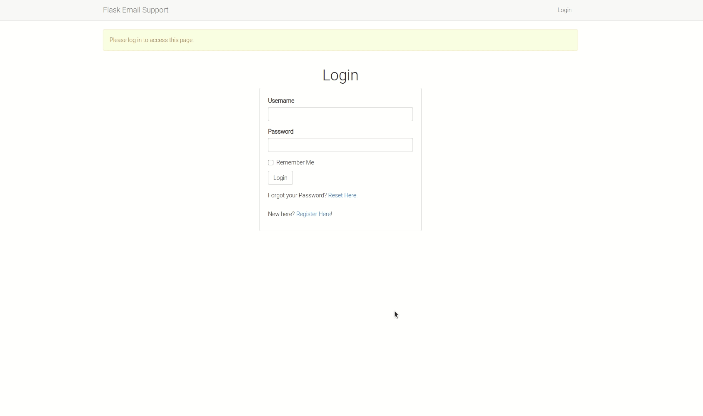
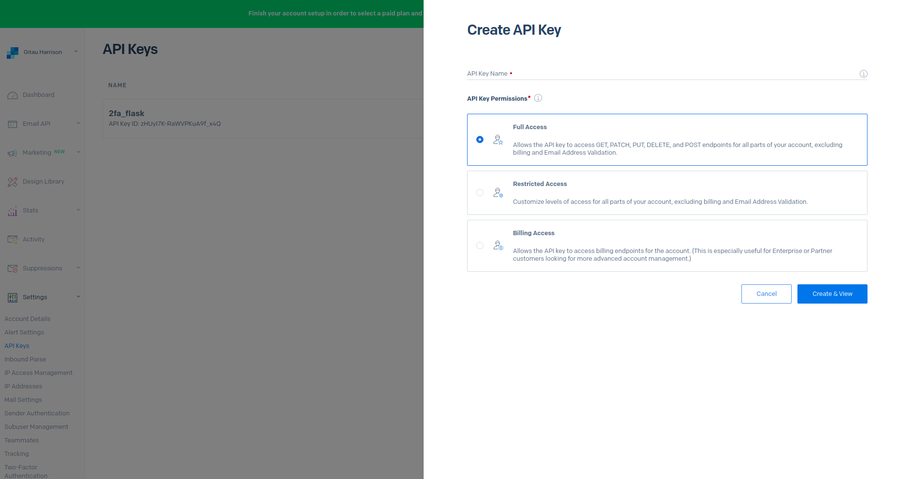
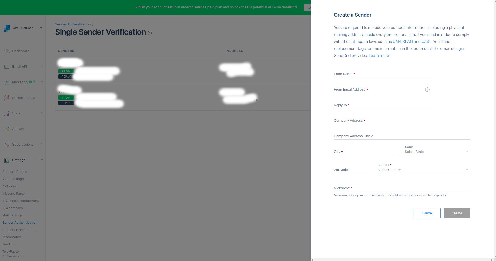
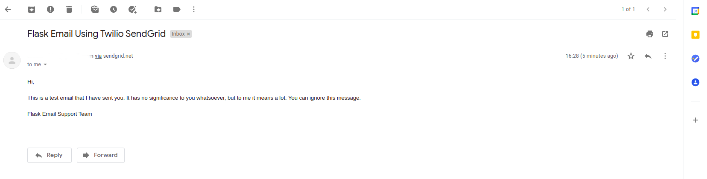

# Sending Emails Using Twilio SendGrid



You can use `flask-mail` to facilitate email sending and recieving in a flask app. This application shows how you can use it to locally send an email to a registered user of the application. Towards the end, I show how you can use [Twilio SendGrid](https://sendgrid.com) to send an email.

### Features

* Password authentication of a user
* Password reset capability

### Tools Used

* Twilio SendGrid API
* Flask web framwork
* Python3 for programming
* Flask mail to enable email communication
* Flask sqlalchemy to create database
* Flask migrate to handle database migrations
* Flask wtf to create secure web forms
* Flask bootstrap for styling and cross-browser responsiveness
* Email validator to validate user emails
* Python dotenv to load environment variables
* Pyngrok to enable localhost testing
* Pyjwt to handle token used in verifying email reset requests
* Flask login to handle user sessions

### Contributors

* [Gitau Harrison](https://github.com/GitauHarrison)

### Testing Locally

1. Clone this repo:

```python
$ git clone git@github.com:GitauHarrison/how-to-add-email-support-in-a-flask-app.git
```

2. Move into the cloned folder

```python
$ cd how-to-add-email-support-in-a-flask-app
```

3. Create and activate a virtual environment:

```python
$ mkvirtualenv flask_email_support 
```

4. Install application dependencies in your virtual environment:

```python
(flask_email_support)$ pip3 install -r requirements.txt
```

5. Before you can run your server, remember to create a `.env` file following the guidance seen in the `.env-template`. Create a `.env` file in the root directory:

```python
(flask_email_support)$ touch .env
```

6. Update the `.env` file with all the necessary details. Remember to add your email environment variables which are:

```python
MAIL_SERVER=
MAIL_PORT=
MAIL_USE_TLS=
MAIL_USERNAME=
MAIL_PASSWORD=
ADMINS=
```

7. Run the flask server:

```python
(flask_email_support)$ flask run
```

Once your application is running, you can access your localhost on http://127.0.0.1:5000/. Additionally, if you look carefully in your terminal, you will see: `* Tunnel URL: NgrokTunnel: "http://4209c9af6d43.ngrok.io" -> "http://localhost:5000"`

The HTTP value may be different from the one shown here because I am using the free tier package of `ngrok`. Paste the link http://4209c9af6d43.ngrok.io on another device, say your mobile phone, to test the application while it is on localhost.

Another way to obtain `ngrok`'s free public URLs would be to run the command below in a new terminal window:

```python
(flask_email_support)$ ngrok http 5000

# Output

ngrok by @inconshreveable                               (Ctrl+C to quit)
                                                                        
Session Status                online                                    
Session Expires               1 hour, 58 minutes                        
Version                       2.3.35                                    
Region                        United States (us)                        
Web Interface                 http://127.0.0.1:4042                     
Forwarding                    http://6e95e59c2233.ngrok.io -> http://loc
Forwarding                    https://6e95e59c2233.ngrok.io -> http://lo
                                                                        
Connections                   ttl     opn     rt1     rt5     p50     p9
                              0       0       0.00    0.00    0.00    0
```
Note the lines beginning with 'Forwarding'. These show the public URLs that ngrok uses to redirect requests into our service. This method also provides you with `https://` for secure connections.

1. Register a user using a valid and accessible email address
2. Log in to the app to verify that your creditials are correct
3. Click on the _Logout_ link at the top-right of the navbar
4. Click on _Reset Here_ link in the _Login_ to reset your password
5. Enter the registered user's email address
6. Check the user's email to see the password reset emal
7. Click the reset link in the email. You will be redirected to a password reset page
8. Enter and confirm your new password
9. Try to log in again using your new password.

You should be able to log in.

### Sending Emails Using Twilio SendGrid

SendGrid can be used to send emails. I will show you how you can do that using the email module we have created in the application above. 

To set up SendGrid, you will need to:

* Create a [free account](https://signup.sendgrid.com/) now
* Log into your account
* Select __Settings__ then click on [API Keys](https://app.sendgrid.com/settings/api_keys)
* Create a new API Key by clicking on the blue button



* Give the API Key a name
* Ensure you select Full Access
* Click Create and View button

Copy the API Key and save it somewhere safe. You will need it later.

Update the config file to include your SendGrid configurations:

```python
# config.py


# Current Email configurations
MAIL_SERVER = os.environ.get('MAIL_SERVER')
MAIL_PORT = int(os.environ.get('MAIL_PORT') or 25)
MAIL_USE_TLS = os.environ.get('MAIL_USE_TLS') is not None
MAIL_USERNAME = os.environ.get('MAIL_USERNAME')
MAIL_PASSWORD = os.environ.get('MAIL_PASSWORD')
ADMINS = ['your-email@example.com']

# SendGrid's email configurations
MAIL_SERVER = os.environ.get('MAIL_SERVER')
MAIL_PORT = int(os.environ.get('MAIL_PORT') or 25)
MAIL_USE_TLS = os.environ.get('MAIL_USE_TLS') is not None
MAIL_USERNAME = os.environ.get('MAIL_USERNAME')
MAIL_PASSWORD = os.environ.get('SENDGRID_API_KEY')
MAIL_DEFAULT_SENDER = os.environ.get('MAIL_DEFAULT_SENDER')
```

Update the `.env` file as follows:

```python
MAIL_SERVER='smtp.sendgrid.net'
MAIL_PORT='587'
MAIL_USE_TLS='True'
MAIL_USERNAME='apikey'
SENDGRID_API_KEY='add-your-api-key-here'
MAIL_DEFAULT_SENDER='a-valid-and-working-email-address'
```

Create a [Sender Identity](https://sendgrid.com/docs/for-developers/sending-email/sender-identity/) as follows:

* From your SendGrid Dashboard, select Settings
* Click on Sender Authentication. You will see Single Sender Verification section
* Click on Verify Single Sender button.
* Create a new Sender by clicking on the blue button. You will see the form below:



* Provide valid and working email addresses for _From Email Address_ and _Reply To_ form fields. You can fill in placeholder data in the other fields.

Activate an instance of the application in the Python interpreter using `flask shell` command:

```python
(flask_email_support) flask shell

# Output
Python-dotenv could not parse statement starting at line 1
Python 3.8.5 (default, Jan 27 2021, 15:41:15) 
[GCC 9.3.0] on linux
App: app [development]
Instance: /home/harry/email_support_in_flask/instance
>>> 
```

Run the following commands the current Python interpreter:

```python
>>> from app import mail
>>> from flask_mail import Message

>>> msg = Message('Sending Email Using Twilio SendGrid', recipients=['a-working-recipient-email-address'])
>>> msg.body = 'Hi, \n\n This is a test email that I have sent you. It has no significance to you whatsoever, but to me it means a lot. You can ignore this message. \n\nFlask Email Support Team'
>>>msg.html = '<p>Hi, <br><br> This is a test email that I have sent you. It has no significance to you whatsoever, but to me it means a lot. You can ignore this message. <br><br>Flask Email Support Team</p>'

>>>mail.send(msg)
```

Hopefully everything goes well and you have received the test email in your inbox.



### Reference

* If you are new to flask, start [here](https://gitauharrison-blog.herokuapp.com/personal-blog)
* If you do not know how to use the `mkvirtualenv` command, learn more [here](https://gitauharrison-blog.herokuapp.com/virtualenvwrapper)